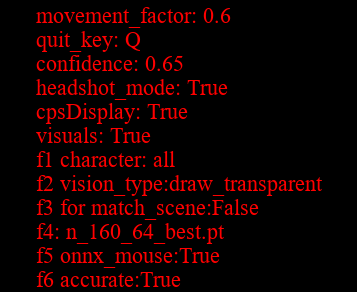

声明：项目中所有游戏画面都来自练习场人机模式，未使用在真人对战中。

# 使用说明：

1.运行main.py

2.输入csgo2的窗口号，回车

3.打开csgo2窗口

左上角会有参数列表：

快捷键可以调节以下参数：
大写锁定：自瞄开关

f1 切换角色['t','ct','all']

f2 更换可视化方案 [在游戏任务边缘画框,直接看yolo返回结果]（影响性能）

f3 是否开启场景匹配（可以根据游戏画面匹配场景，可以实现自动移动）（影响性能）

f4 切换yolo模型

f5 使用神经网络模拟人手移动鼠标(bool)

f6 较小的射击阈值（距离目标中心距离多少才开枪）

Q：退出

