<video src="技术报告.assets/6月25日.mp4"></video>

# 数据集：

​	来自[Cs2 Dataset > Overview (roboflow.com)](https://universe.roboflow.com/egor-40xaz/cs2-guwti)

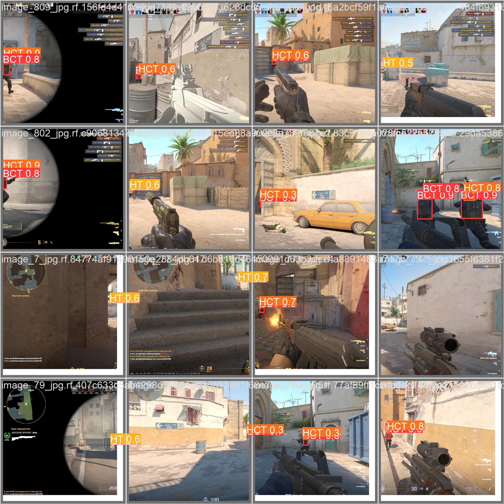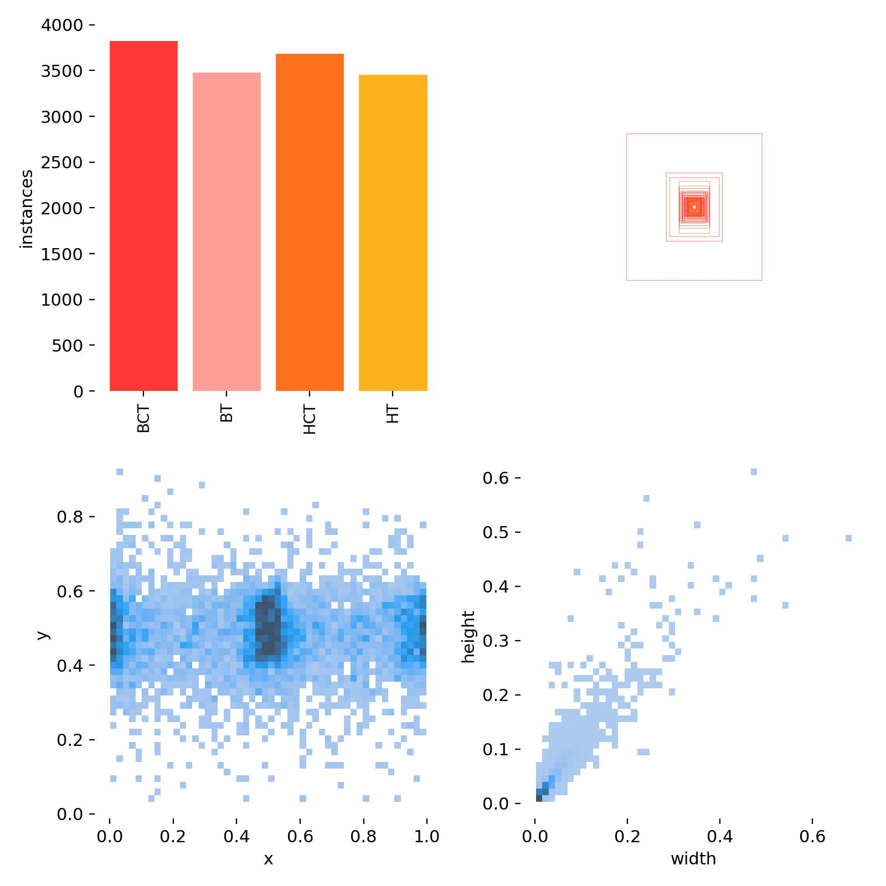

使用了cs2数据集，经过验证，cs1数据集在识别cs2人物时精准度极差。以下为对比，

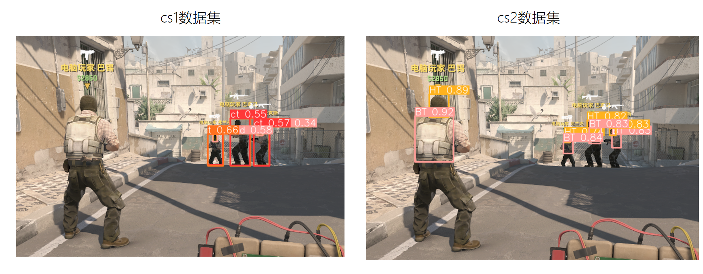

使用的数据集有四个标签：HT(T的头)、BT(T的身体)、HCT、BCT。


# 模型训练：

使用yolov8n在训练集训练160轮，batch=64。显存占用10G以上。耗时超过1h。

使用yolov8s在训练集训练160轮，batch=64。显存占用10G以上。耗时超过3h。

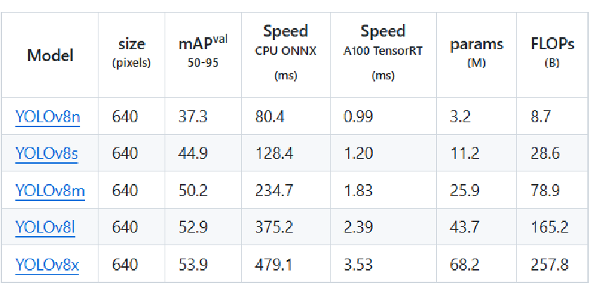

yolov8n在训练集训练160轮，batch=64结果如下：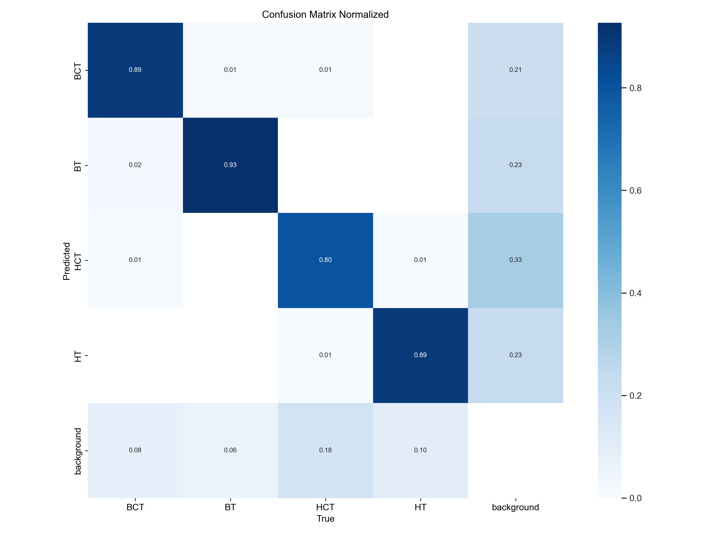

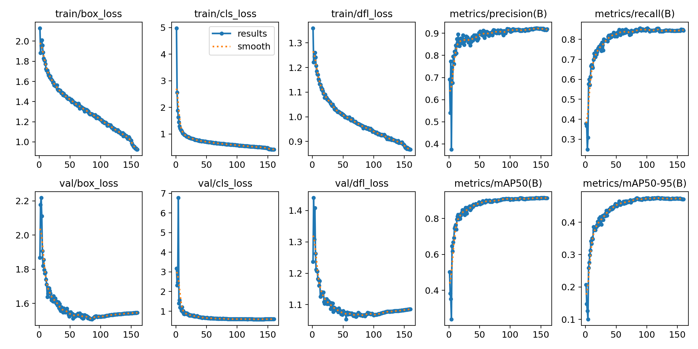


yolov8s在训练集训练160轮，batch=64结果如下：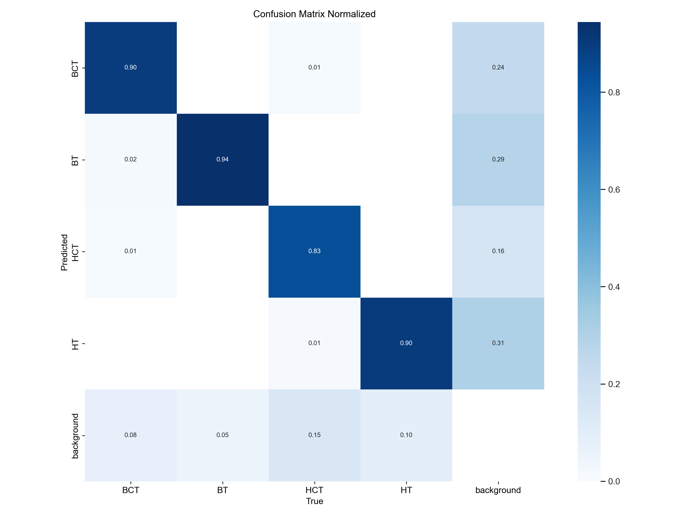

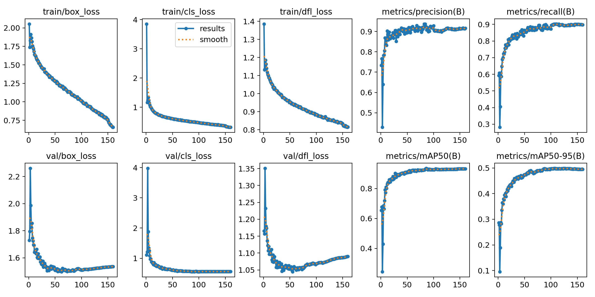


最终选择模型：yolov8n。

原因：其实实际性能只和yolov8s有几帧的区别，但是yolov8n多次训练进行比较时间耗费只要yolov8s一半以内。


# 尝试识别倒地角色（失败）：

我尝试将跌落检测里人摔跤的图片作为游戏中倒地角色，防止yolo模型误识别已到底角色为目标，影响效果。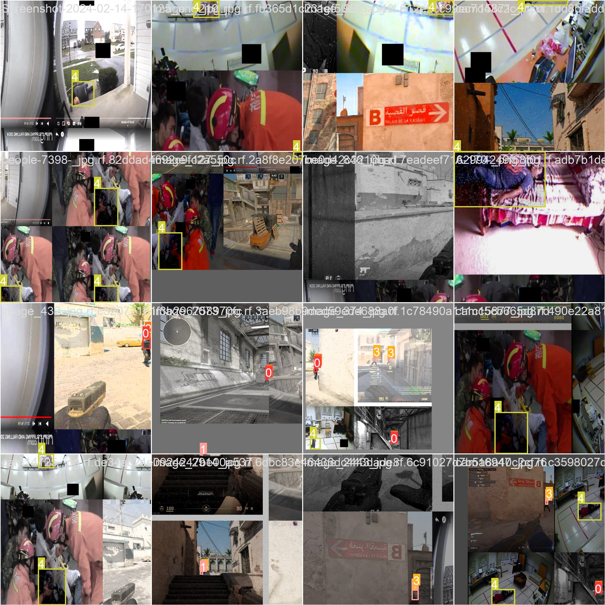

但是经过实测，未特殊处理的模型识别到倒地人物未偶发事件，并且经过特殊处理的模型也未能识别到倒地人物。猜测是因为颜色作为一个过于显著的特征。


# 鼠标轨迹模拟人手移动：

用神经网络来拟合真人鼠标移动轨迹。该神经网络其实很简单，只有三个全连接层。输入为目标距离当前位置的dx，dy。输出为10个点用来模拟真人的轨迹。

```python
#train的网络结构
class SimpleNet(nn.Module):
    def __init__(self):
        super(SimpleNet, self).__init__()
        self.fc1 = nn.Linear(2, 64)
        self.fc2 = nn.Linear(64, 32)
        self.fc3 = nn.Linear(32, 20)

    def forward(self, input_data):
        x = torch.flatten(input_data, start_dim=1)
        x = self.fc1(x)
        x = nn.ReLU()(x)
        x = self.fc2(x)
        x = nn.ReLU()(x)
        x = self.fc3(x)
        return x.view(-1, 10, 2)
```

效果图如下：

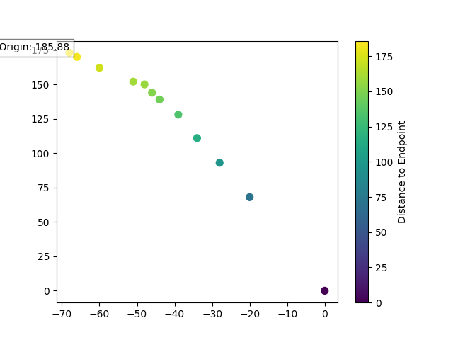

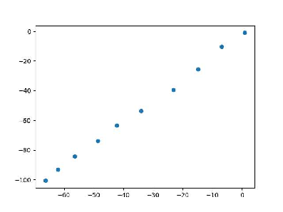

具体轨迹特征与被采集者习惯有关。


# 自动地图巡回：

<video src="技术报告.assets/巡回.mp4"></video>

实现方式：在一组模板图像中找到最匹配的那个图像。使用SIFT来识别图像中的特征点，然后用FLANN匹配器来比较这些特征点。

**特征提取（SIFT）**：

- 想象你有两张照片，并且你希望找到它们之间的相似点（比如，找到同一个物体在两张照片中的位置）。
- SIFT 是一种算法，用于从图像中提取独特的关键点和描述符。这些关键点类似于我们在照片中能辨认出的独特标志，比如角、边缘或者其他独特的结构。
- 每个关键点都被描述符进一步描述，这些描述符是用来唯一标识该关键点的向量。

**特征匹配（FLANN）**：

- 一旦我们从两张照片中提取了关键点和描述符，就需要比较它们，找出匹配的关键点。
- 由于直接比较所有描述符会非常耗时，FLANN 是一种用于加速这个过程的算法。它是一种快速近似最近邻搜索库，可以快速找到两张照片之间相似的描述符。
- 通过 FLANN，我们可以有效地找到两张照片中的匹配点。

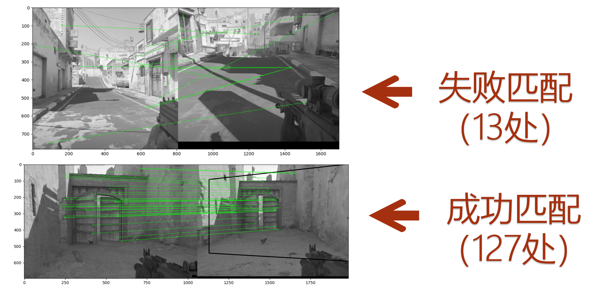

图片匹配代码如下，输入为实时采集的图片，与预设的图片集合一一比较，有超过阈值且返回相似点最多的一张

```python
def sift_flann_matching(target_img, min_match_count=50):
    sift = cv2.SIFT_create()
    flann_index_kdtree = 0
    index_params = dict(algorithm=flann_index_kdtree, trees=5)
    search_params = dict(checks=50)
    flann = cv2.FlannBasedMatcher(index_params, search_params)

    target_kp, target_des = sift.detectAndCompute(target_img, None)
    best_match = None
    best_match_index = None
    i=-1

    for template in templates:
        i+=1
        template_kp, template_des = sift.detectAndCompute(template, None)
        if template_des is None or target_des is None:
            continue
        matches = flann.knnMatch(template_des, target_des, k=2)
        good = []
        for m, n in matches:
            if m.distance < 0.7 * n.distance:
                good.append(m)
        if len(good) > min_match_count:
            if best_match is None or len(good) > best_match:
                best_match = len(good)
                best_match_index=i
    return best_match_index, best_match
```

跑图功能只要根据匹配的具体位置进行相应的鼠标键盘操作输入即可。

```python
win32api.mouse_event(win32con.MOUSEEVENTF_MOVE, 1500, 0, 0, 0)

def press_w_key(m):
    keyboard.press('w')
    time.sleep(m)
    keyboard.release('w')

# Function to start the thread
def start_pressing_w_key(m):
    print(f"前进{m}s")
    press_thread = threading.Thread(target=press_w_key, args=(m,))
    press_thread.start()
```


# 可视化方案1：直接输出yolo模型检测的画面

优点：对性能要求低，更加清晰

缺点：不够直观，占用显存（可能从55帧掉到30帧）

具体代码如下：

```python
for result in results:
    img = result.plot()
cv2.imshow('YOLO', img)
if cv2.waitKey(1) & 0xFF == ord(quit_key):
    break
```

可以说非常好实现。

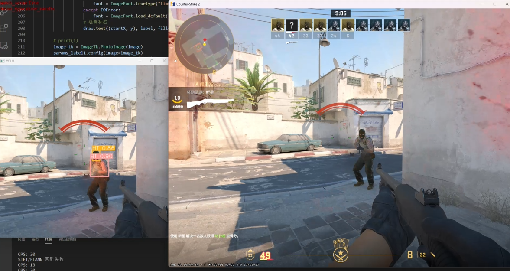

# 可视化方案2：使用透明窗口在游戏屏幕上标识目标

优点：直观，直接显示在游戏画面上

缺点：影响游戏画面识别，鼠标会点击到透明窗口导致离开游戏画面。

方法：用tkinter调用一个覆盖在屏幕上的透明窗口，然后根据yolo返回的目标的`'current_mid_x', 'current_mid_y', 'width', "height", "confidence", "class"`，可以画出具体的框，标出置信度和类别。


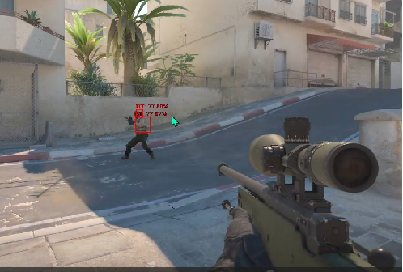

主要代码如下：

```python
root1 = Toplevel()#有别的窗口就得用这个初始化，否则会崩
root1.geometry(f"{screenShotHeight}x{screenShotWidth}+{region[0]}+{region[1]}")  # 窗口大小与位置
root1.attributes("-topmost", 1)  # 窗口置顶
root1.overrideredirect(True)  # 无边框窗口
root1.attributes("-transparentcolor", "black")  # 设置黑色为透明色

targets = pd.DataFrame(
    targets, columns=['current_mid_x', 'current_mid_y', 'width', "height", "confidence", "class"])

def update_params_label(targets):
    # 获取当前屏幕截图
    COLORS = [(255, 0, 0)]
    image = Image.new('RGBA', (screenShotHeight, screenShotHeight), (0, 0, 0, 0))  # 创建一个透明背景的图像
    draw = ImageDraw.Draw(image)
    if len(targets) > 0:
        for i in range(len(targets)):
            conf = targets["confidence"].iloc[i]
            if conf >=confidence:
                halfW = round(targets["width"].iloc[i] / 2)
                halfH = round(targets["height"].iloc[i] / 2)
                midX = targets['current_mid_x'].iloc[i]
                midY = targets['current_mid_y'].iloc[i]
                startX, startY, endX, endY = int(midX - halfW), int(midY - halfH), int(midX + halfW), int(midY + halfH)
                cls_id = int(targets['class'].iloc[i])
                label = "{}: {:.2f}%".format(model.names[cls_id], targets["confidence"].iloc[i] * 100)

                # 绘制边界框
                draw.rectangle([startX, startY, endX, endY], outline=COLORS[0], width=2)
                # 确定标签的位置
                y = startY - 15 if startY - 15 > 15 else startY + 15
                # 加载字体
                try:
                    font = ImageFont.truetype("times.ttf", 15)
                except IOError:
                    font = ImageFont.load_default()
                # 绘制标签
                draw.text((startX, y), label, fill=COLORS[0], font=font)

    image_tk = ImageTk.PhotoImage(image)
    params_label1.config(image=image_tk)
    params_label1.image = image_tk  # 保持引用
```


# 快捷键切换config参数：

这里是按f1切换了人物角色。很好用。

```python
states = ['t','ct','all']
if win32api.GetKeyState(0x70):  # 检查最高位是否为 1
    state = win32api.GetKeyState(0x70)
    if state < 0:  # 检查最高位是否为 1
        win32api.keybd_event(0x70, 0, win32con.KEYEVENTF_KEYUP, 0)  # 松开
        current_state_index = (current_state_index + 1) % 3
        character = states[current_state_index]
        print(f"Current character: {character}")
```

